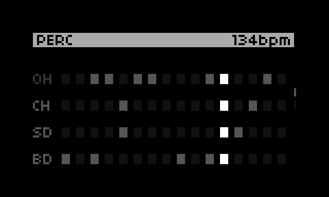
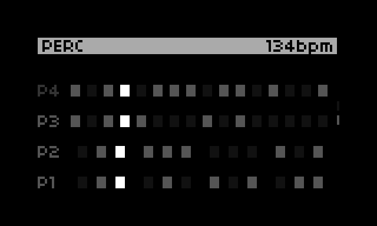

# Perc

A [Norns](https://monome.org/docs/norns/) script that Generates random drum/percussion patterns




## About

Perc generates random drum/percussion patterns and triggers them via MIDI.

It supports 8 different drum channels or notes, and can be set to 16th notes or 8th note triplets.

Perc does not generate music on its own. It is purely a MIDI sequencer.

## Options

Options can be set through the Norns setting screen.

## Installation

```
;install https://github.com/jtopjian/perc
```

## Thanks

Some of the pattern generating logic is based off of The Endless Acid Banger:

* https://github.com/zykure/acid-banger
* https://github.com/vitling/acid-banger
